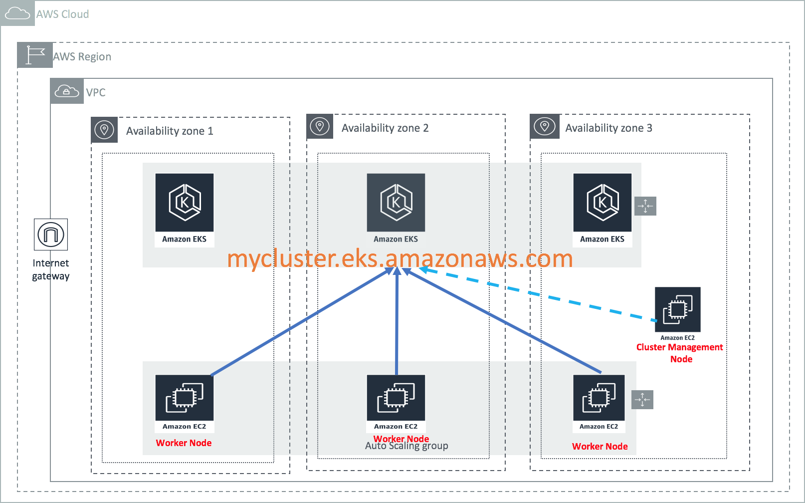

## EKS Reference Architecture CloudFormation

An Automated solution which builds Amazon EKS Cluster and joins Amazon EKS worker nodes with the control plane to deploy containerized microservices with AWS CloudFormation.

## Overview

Overview of the "public/*" directory:

- public/EKS-PreReqs.yaml: Creates a VPC with 3 Public Subnets associated with an IGW, an EKS Service Role, a Control Plane SecurityGroup and a CloudFormation Service Role which will be used to create public/EKS-Infra.yaml template.
- public/EKS-Infra.yaml: Creates Amazon EKS control plane, Amazon EKS worker nodes and a nested template "EKS-ClusterManagementNode.yaml" .
- public/EKS-ClusterManagementNode.yaml: Creates an EC2 instance, which is used to register EKS worker nodes with the control plane, deploys a kubernetes-dashboard and provides a ready to use platform for customers, so they can SSH into it and start deploying container workloads.

Overview of the "private/*" directory:

- private/EKS-PreReqs-Private.yaml: Creates a VPC with 3 Public Subnets and 3 Private Subnets with 3 NAT Gateways one in each zone to handle outbound traffic, an EKS Service Role, a Control Plane SecurityGroup and a CloudFormation Service Role which will be used to create public/EKS-Infra.yaml template.
- private/EKS-Infra.yaml: Creates Amazon EKS control plane, Amazon EKS worker nodes and a nested template "EKS-ClusterManagementNode.yaml" .
- private/EKS-ClusterManagementNode.yaml: Creates an EC2 instance, which is used to register EKS worker nodes with the control plane, deploys a kubernetes-dashboard and provides a ready to use platform for customers, so they can SSH into it and start deploying container workloads.

### Customize the templates

1. [Fork](https://github.com/aws-samples/eks-refarch-cloudformation) this GitHub repository.
2. Clone the forked GitHub repository to your local machine.
3. Modify the templates.
4. Upload them to an Amazon S3 bucket of your choice.
5. Update your existing stack with your version of the templates.

## License Summary

This sample code is made available under a modified MIT license. See the LICENSE file.
